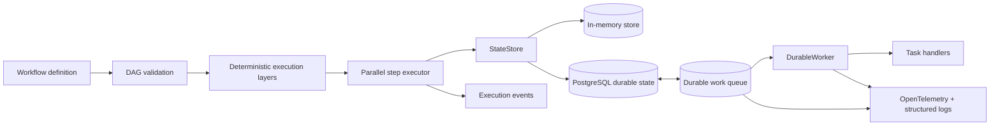

# Architecture

FlowForge separates workflow semantics from infrastructure adapters. The core package owns validation, scheduling semantics, retries, timeouts, idempotency, execution events, and the state-store contract. PostgreSQL persistence and durable work distribution implement those contracts without leaking database concepts into workflow definitions.

## System view



The in-process DAG runtime and the distributed worker substrate solve related but distinct problems. Workflow definitions remain portable; persistence, worker coordination and observability live behind explicit contracts.

## Engineering invariants

| Concern | FlowForge behavior |
| --- | --- |
| Graph validity | Duplicate ids, unknown dependencies, self-dependencies and cycles are rejected before execution. |
| Scheduling | Independent steps in the same deterministic layer execute concurrently; later layers wait for the active layer. |
| Failure boundary | A failed layer settles already-started siblings but schedules no downstream layer. |
| Retry behavior | Attempts and exponential backoff are bounded and normalized. |
| Cancellation | Timed steps receive an `AbortSignal`; user code must cooperate with cancellation. |
| Idempotency | Keys are namespaced by workflow and step; cached `undefined` remains distinguishable from a cache miss. |
| Durable state | PostgreSQL persists run and idempotency state behind the same state-store abstraction. |
| Work ownership | Durable work uses expiring leases, worker identity and stale-worker fencing. |
| Crash recovery | Expired work leases can be reclaimed after worker loss. |
| Retry races | PostgreSQL row locking protects durable retry state transitions. |
| Delivery model | Distributed work is at-least-once; external side effects still require stable business idempotency. |
| Observability | OpenTelemetry and structured logs observe execution without becoming a correctness dependency. |
| Supply chain | Third-party GitHub Actions used by CI/security analysis are pinned to reviewed immutable commit SHAs. |

## Core execution path

```text
WorkflowDefinition
       |
       v
+--------------------+
| DAG validation     |
| - unique ids       |
| - dependency refs  |
| - cycle detection  |
+--------------------+
       |
       v
+--------------------+
| deterministic      |
| execution layers   |
+--------------------+
       |
       v
+--------------------+       +-------------------+
| parallel step      |------>| execution events  |
| executor per layer |       +-------------------+
| - retry            |
| - backoff          |
| - timeout          |
| - AbortSignal      |
| - idempotency      |
+--------------------+
       |
       v
+--------------------+
| StateStore         |
| memory/PostgreSQL  |
+--------------------+
```

## Design boundaries

### Workflow definition

A workflow is a stable identifier plus steps. Each step may depend on previous steps and receives an immutable snapshot of completed outputs through `context`.

### Graph validation

Validation happens before any work begins. Unknown dependencies, duplicate ids, self-dependencies, and cycles are rejected before side effects can occur.

### Parallel scheduling

The validated DAG is converted into deterministic execution layers. Every step in a layer has all of its dependencies satisfied by earlier layers, so independent steps in the same layer start concurrently with the same immutable context snapshot.

FlowForge uses a layer barrier: the next layer starts only after every step in the active layer settles successfully. This makes fan-out/fan-in behavior deterministic and prevents downstream work from observing partial sibling state.

If any step in a layer fails after exhausting retries, FlowForge still waits for the other already-started steps in that layer to settle. Successful sibling outputs remain visible in the failed run result, but no later layer is scheduled. This avoids abandoning active promises while preserving a clear failure boundary.

### Retry behavior

Retries are a step-level contract. Attempts, initial backoff, multiplier, and maximum backoff are normalized at runtime so malformed numeric values cannot create infinite retry loops.

### Timeouts

A timed step receives an `AbortSignal`. When the timeout expires FlowForge aborts the signal and marks the attempt failed. JavaScript cannot forcibly stop arbitrary user code, so step implementations should cooperate with the signal when invoking cancellable APIs.

### Idempotency

User idempotency keys are namespaced internally by workflow and step. The store lookup is an explicit `{ found, value }` result so `undefined` remains a valid cached output rather than being mistaken for a cache miss.

### State stores

The in-memory store supports zero-dependency development. The PostgreSQL implementation adds durable run and idempotency storage while preserving the same workflow-facing abstraction. Database migrations are versioned and concurrency-safe.

## Durable work distribution

The PostgreSQL work queue adds a separate distributed-execution substrate:

1. work is enqueued durably;
2. workers register and heartbeat;
3. a worker claims work through an expiring lease;
4. stale ownership is fenced after lease replacement;
5. failed work can transition through bounded retries;
6. terminal work enters dead-letter state;
7. expired leases can be reclaimed after a worker disappears.

Retry transitions use PostgreSQL row locking so concurrent workers cannot independently advance the same durable retry state.

`DurableWorker` maps durable task types to application handlers. This keeps queue coordination separate from business logic while still exposing cancellation and lifecycle behavior.

## Delivery semantics

Durable distributed work is **at-least-once**. A worker can perform an external side effect and fail before durable completion is recorded, so the system does not advertise exactly-once execution. Handlers that touch external systems should use stable business idempotency keys.

## Observability boundary

FlowForge emits execution events, OpenTelemetry spans/metrics and safe structured logs. Telemetry is observational: missing exporters or providers must not alter workflow correctness. Health and readiness handlers expose operational state without becoming workflow dependencies.

## Explicit non-claims

FlowForge does not claim:

- exactly-once external side effects
- that JavaScript timeouts can forcibly terminate arbitrary user code
- that observability backends participate in correctness
- that workflow definitions need to know PostgreSQL or queue implementation details

Those boundaries are deliberate so failure behavior stays inspectable rather than implied.